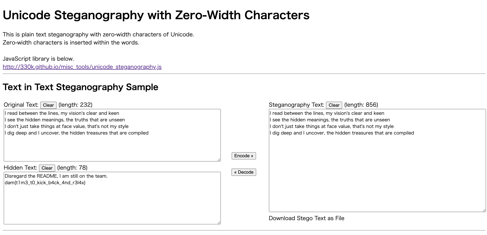

### Problem Description ### 
In this challenge we are given a zip file ```message.zip```, and we are asked to use steganography skills to get the flag from this zip file.

### Approach ###
On unzipping the file we get a ```README.txt``` and nothing else. On doing ```binwalk message.zip```, we see the following output
```
DECIMAL       HEXADECIMAL     DESCRIPTION
--------------------------------------------------------------------------------
0             0x0             Zip archive data, at least v2.0 to extract, compressed size: 311, uncompressed size: 533, name: README.txt
351           0x15F           Zip archive data, at least v2.0 to extract, compressed size: 407, uncompressed size: 2104, name: secret.txt
854           0x356           End of Zip archive, footer length: 22
```
So there is a ```secret.txt``` file as well there but unzip is unable to extract it.

I used the following commands to extract ```secret.txt```
```
dd if=message.zip of=test.zip skip=351 bs=1
binwalk -e test.zip
cat _test.zip.extracted/secret.txt
```

The output of secret.txt looks like this
```
 I read between the lines, my vision's clear and keen
I see the hidden meanings, the truths that are unseen
 I don't just take things at face value, that's not my style
I dig deep and I uncover, the hidden treasures that are compiled
```
On seeing the output in vim or xxd, we see a lot of unicode characters being repeated like \u200c, \u200d, \u202c, \ufeff.

On googling, I found that this is a common technique called Unicode steganography with zero width characters and I came across a tool - https://330k.github.io/misc_tools/unicode_steganography.html 

In order to copy the contents from secret.txt, I used the commands 
```
cat secret.txt | DISPLAY=:0 xclip -sel clip 
```
Then pasting the contents in tool gave the flag


