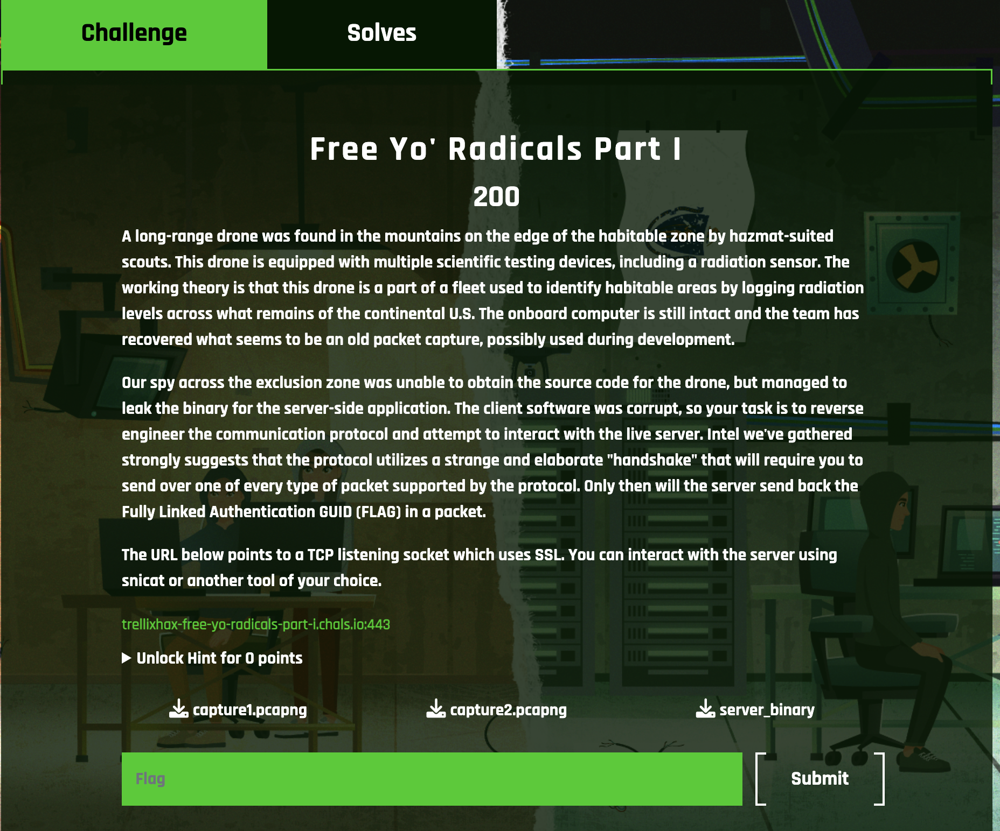

#### Free Yo' Radicals Part I ####

----
Challenge description
----

Here is a description of the challenge



In this challenge we are given a server binary and 2 pcap files. The pcap files were not necessary for the challenge. On checking the binary using `checksec` we see the following results:
```
    Arch:     amd64-64-little
    RELRO:    No RELRO
    Stack:    Canary found
    NX:       NX enabled
    PIE:      No PIE (0x400000)
``` 
So there is no RELRO and PIE in the binary. Next step is to analyse the binary in Ghidra

------
Analysis using Ghidra
-------

On decompiling the binary using Ghidra we see the following results. The main function looks like this 

```
int main(int argc,char **argv)

{
  long lVar1;
  uint16_t uVar2;
  int iVar3;
  int *piVar4;
  long lVar5;
  char *pcVar6;
  long in_FS_OFFSET;
  int option;
  int addrlen;
  int port;
  pid_t parent;
  int sockfd;
  int clientfd;
  pid_t child;
  char *p;
  sockaddr_in self;
  sockaddr_in client_addr;
  
  lVar1 = *(long *)(in_FS_OFFSET + 0x28);
  piVar4 = __errno_location();
  *piVar4 = 0;
  port = 9999;
  option = 1;
  addrlen = 0x10;
  parent = getpid();
  if (argc == 2) {
    lVar5 = strtol(argv[1],&p,10);
    port = (int)lVar5;
  }
  printf("[+] Listening port: %d\n",(ulong)(uint)port);
  sockfd = socket(2,1,0);
  if (sockfd < 0) {
    perror("Socket");
    piVar4 = __errno_location();
                    /* WARNING: Subroutine does not return */
    exit(*piVar4);
  }
  setsockopt(sockfd,1,2,&option,4);
  bzero(&self,0x10);
  self.sin_family = 2;
  self.sin_port = htons((uint16_t)port);
  self.sin_addr.s_addr = 0;
  iVar3 = bind(sockfd,(sockaddr *)&self,0x10);
  if (iVar3 != 0) {
    perror("socket--bind");
    piVar4 = __errno_location();
                    /* WARNING: Subroutine does not return */
    exit(*piVar4);
  }
  iVar3 = listen(sockfd,0x14);
  if (iVar3 == 0) {
    while( true ) {
      clientfd = accept(sockfd,(sockaddr *)&client_addr,(socklen_t *)&addrlen);
      uVar2 = ntohs(client_addr.sin_port);
      pcVar6 = inet_ntoa((in_addr)client_addr.sin_addr.s_addr);
      printf("%s:%d connected\n",pcVar6,(ulong)uVar2);
      child = fork();
      if (child == -1) break;
      if (child == 0) {
        zechallenge(clientfd);
      }
      close(clientfd);
    }
    perror("Failed to fork");
    if (lVar1 == *(long *)(in_FS_OFFSET + 0x28)) {
      return 1;
    }
                    /* WARNING: Subroutine does not return */
    __stack_chk_fail();
  }
  perror("socket--listen");
  piVar4 = __errno_location();
                    /* WARNING: Subroutine does not return */
  exit(*piVar4);
}

```

This looks like a server running on port 9999 and all new connections call a function zechallenge, the disassembly of zechallenge gives the following

```
void zechallenge(int clientfd)

{
  bool bVar1;
  bool bVar2;
  bool bVar3;
  int iVar4;
  size_t sVar5;
  ssize_t sVar6;
  __uint64_t _Var7;
  long lVar8;
  packet *ppVar9;
  long in_FS_OFFSET;
  byte bVar10;
  int numentries;
  int count;
  int loopout;
  uint choice;
  uint index;
  ulong del_value;
  string *curstr;
  number *curnum;
  string *current;
  string *previous;
  number *current_1;
  number *previous_1;
  string *tempstr;
  number *tempnum;
  char *hellomessage;
  char *optionsmessage;
  char *byemessage;
  timeval tv;
  _Bool ops_completed [4];
  packet p;
  char buffer [46];
  char message [46];
  long local_10;
  
  bVar10 = 0;
  local_10 = *(long *)(in_FS_OFFSET + 0x28);
  curstr = (string *)0x0;
  curnum = (number *)0x0;
  bVar1 = false;
  bVar2 = false;
  bVar3 = false;
  tv.tv_sec = 5;
  tv.tv_usec = 0;
  numentries = 0;
  setsockopt(clientfd,1,0x14,&tv,0x10);
  setsockopt(clientfd,1,0x15,&tv,0x10);
  sVar5 = strlen("Connected\n");
  send(clientfd,"Connected\n",sVar5,0);
  do {
    while( true ) {
      sVar5 = strlen("\nWaiting for data... \n");
      sVar6 = send(clientfd,"\nWaiting for data... \n",sVar5,0);
      if ((sVar6 < 0) || (sVar6 = recv(clientfd,buffer,0x2e,0), sVar6 == 0)) {
        close(clientfd);
        if (local_10 != *(long *)(in_FS_OFFSET + 0x28)) {
                    /* WARNING: Subroutine does not return */
          __stack_chk_fail();
        }
        return;
      }
      ppVar9 = &p;
      for (lVar8 = 5; lVar8 != 0; lVar8 = lVar8 + -1) {
        *(undefined8 *)ppVar9 = 0;
        ppVar9 = (packet *)((long)ppVar9 + (ulong)bVar10 * -0x10 + 8);
      }
      ppVar9->clientfd = 0;
      parse_packet(&p,(uchar *)buffer);
      printf("action: %d\n",(ulong)(uint)p.action);
      if (p.action == 2) break;
      if (p.action < 3) {
        if (p.action == 1) {
          if (!bVar1) {
            bVar1 = true;
          }
          if (numentries < 6) {
            iVar4 = checkForTermination(p.datafield_1,0x10);
            if (iVar4 == 0) {
              curstr = (string *)malloc(0x28);
              *(undefined8 *)curstr->buffer = p.datafield_1._0_8_;
              *(undefined8 *)(curstr->buffer + 8) = p.datafield_1._8_8_;
              curstr->buffer[0x10] = '\0';
              curstr->print = send_str;
              curstr->next = string_head;
              string_head = curstr;
              puts("Created new coordinate");
            }
            else {
              puts("Error: Termination char found in coordinate");
            }
            iVar4 = checkForTermination(p.datafield_2,8);
            if (iVar4 == 0) {
              curnum = (number *)malloc(0x28);
              curnum->num = (ulong)p.datafield_2;
              _Var7 = __bswap_64(curnum->num);
              curnum->num = _Var7;
              curnum->print = send_num;
              curnum->next = number_head;
              number_head = curnum;
              puts("Created new radiation value!");
            }
            else {
              puts("Send error message. Termination char found in radiation value\n");
            }
            numentries = numentries + 1;
          }
          else {
            puts("Error: Max Entries reached");
          }
        }
      }
      else if (p.action == 3) {
        if (!bVar3) {
          bVar3 = true;
        }
        if (numentries == 0) {
          puts("Warning: There is no entries to print");
        }
        else {
          count = 0;
          _Var7 = __bswap_64((__uint64_t)p.datafield_2);
          if (_Var7 == 1) {
            tempstr = curstr;
            tempnum = curnum;
            count = 5;
          }
          else {
            tempstr = string_head;
            tempnum = number_head;
          }
          for (; ((tempnum != (number *)0x0 && (tempstr != (string *)0x0)) && (count < 6));
              count = count + 1) {
            (*tempnum->print)(tempnum->num,message);
            sVar5 = strlen(message);
            send(clientfd,message,sVar5,0);
            (*tempstr->print)(tempstr->buffer,message);
            sVar5 = strlen(message);
            send(clientfd,message,sVar5,0);
            tempnum = tempnum->next;
            tempstr = tempstr->next;
          }
        }
      }
      else if (p.action == 5) {
        if (((bVar1) && (bVar2)) && (bVar3)) {
          print_flag(clientfd);
        }
        sVar5 = strlen("\n[+] Bye bye!\n");
        send(clientfd,"\n[+] Bye bye!\n",sVar5,0);
        close(clientfd);
                    /* WARNING: Subroutine does not return */
        exit(0);
      }
    }
    if (!bVar2) {
      bVar2 = true;
    }
    if (((numentries == 0) || (string_head == (string *)0x0)) ||
       (iVar4 = checkForTermination(p.datafield_1,0x10), iVar4 != 0)) {
      puts("Warning: There are no coordinates left to delete");
    }
    else {
      previous = (string *)0x0;
      for (current = string_head; current != (string *)0x0; current = current->next) {
        iVar4 = strcmp(p.datafield_1,current->buffer);
        if (iVar4 == 0) {
          puts("Deleted requested coordinate");
          if (current == string_head) {
            string_head = string_head->next;
          }
          else {
            previous->next = current->next;
          }
          free(current);
          break;
        }
        previous = current;
      }
    }
    if (((numentries == 0) || (number_head == (number *)0x0)) ||
       (iVar4 = checkForTermination(p.datafield_2,8), iVar4 != 0)) {
      puts("Warning: There are no radiation values left to delete");
    }
    else {
      current_1 = number_head;
      previous_1 = (number *)0x0;
      _Var7 = __bswap_64((__uint64_t)p.datafield_2);
      for (; current_1 != (number *)0x0; current_1 = current_1->next) {
        if (current_1->num == _Var7) {
          puts("Deleted requested radiation value");
          if (current_1 == number_head) {
            number_head = number_head->next;
          }
          else {
            previous_1->next = current_1->next;
          }
          free(current_1);
          break;
        }
        previous_1 = current_1;
      }
    }
    numentries = numentries + -1;
  } while( true );
}

```

This function takes data from the client and calls ```parse_packet```, so this means we need to provide our data in a specific format. Going inside the ```parse_packet``` function we see that our data should look something look something like this

+-----------------------------------------------------------------------------------------------------------------------------+  
| ip addr | Delim | Port | Delim | Timestamp | delim | Action | delim | Data1 | delim | Data1 | delim | data1 | delim | data1 | delim | data2 | terminator |  
+-----------------------------------------------------------------------------------------------------------------------------+

going by the code if we send the following actions
- create (action 1)
- print (action 3)
- delete (action 2)
- exit ( action 5)
we will get the flag

